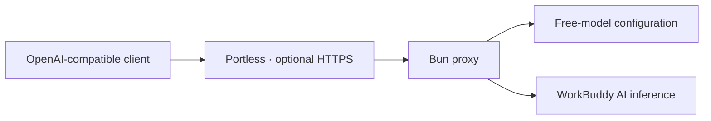

<p align="center">
  
</p>

<h1 align="center">WorkBuddy Proxy</h1>

<p align="center">
  将 WorkBuddy AI 的免费模型，接到你习惯的客户端。
  <br />
  Bun + TypeScript · Docker · 本地 HTTPS · 流式输出
</p>

<p align="center">
  <a href="https://bun.sh"></a>
  <a href="https://www.typescriptlang.org"></a>
  <a href="compose.yaml"></a>
  <a href="#api-示例"></a>
  <a href="package.json"></a>
</p>

<p align="center">
  <a href="#快速开始">快速开始</a> ·
  <a href="#配置">配置</a> ·
  <a href="#portless-本地-https">Portless</a> ·
  <a href="#故障排查">故障排查</a> ·
  <a href="CONTRIBUTING.md">参与开发</a>
</p>

---

面向自己账号的非官方本地适配项目。动态发现当前免费模型，通过 OpenAI Chat Completions 接口提供给第三方客户端，支持 SSE 流式透传与非流式聚合。运行时无第三方 JavaScript 依赖。

## 功能

- **动态模型目录**：每次查询和调用前读取上游配置，仅放行明确为零费率或处于有效免费活动中的模型。
- **原生 HTTP**：`Bun.serve` + `fetch` 直接传递 JSON 请求体，支持较大的上下文和工具定义。
- **流式响应**：逐块转发上游 SSE，保留推理内容和工具调用字段。
- **非流式响应**：聚合文本、推理、工具参数和 usage；检测流中断。
- **Docker**：只读挂载登录目录，独立数据卷保存代理密钥；重建容器不更换密钥。
- **Portless**：可使用 `https://workbuddy.localhost/v1` 作为固定入口。

## 工作方式



默认宿主机映射端口为 `127.0.0.1:18081`。上游固定为 `https://www.workbuddy.ai`，当前适配海外版 WorkBuddy AI 的登录文件。

## 快速开始

### 1. 准备登录状态

先安装并登录 WorkBuddy AI。macOS 默认认证文件位置：

```text
~/Library/Application Support/CodeBuddyExtension/Data/Public/auth/workbuddy-desktop-ai.info
```

项目不会发起登录、提取其他应用账号或自动刷新令牌。每次上游请求在内存中读取此文件；登录过期后，在 WorkBuddy AI 重新登录即可。

### 2. 启动 Docker

```bash
git clone https://github.com/RoggeOhta/workbuddy-proxy.git
cd workbuddy-proxy
cp .env.example .env
docker compose up -d --build
```

macOS 默认路径可直接使用。Linux / 远程主机需在 `.env` 的 `WORKBUDDY_AUTH_DIR` 中指定已准备好的认证目录，该目录必须包含 `workbuddy-desktop-ai.info`。

Compose 项目名默认为 `workbuddy-proxy`。同一主机部署多个实例时，请分别设置项目名和宿主机端口，确保数据卷和端口独立。

### 3. 获取代理密钥

```bash
docker compose exec -T proxy cat /data/.api-key
```

macOS 可直接复制到剪贴板：

```bash
docker compose exec -T proxy cat /data/.api-key | pbcopy
```

这是本地代理的访问密钥，与 WorkBuddy 登录令牌不同。本机直接运行与 Docker 各自生成密钥，不可混用。

### 4. 配置客户端

| 字段 | 值 |
| --- | --- |
| API 协议 | OpenAI Chat Completions / `openai-completions` |
| Base URL | `http://127.0.0.1:18081/v1` |
| API Key | 上一步读取的代理密钥，不加 `Bearer` 前缀 |
| 模型目录 | 点击“获取可用模型”，以实时返回为准 |

模型目录由上游账号配置和免费活动决定，不维护固定模型清单。客户端应使用 `/v1/models` 返回的完整 ID；同名模型的不同线路可能具有不同费率。免费活动结束后应刷新模型目录。

## Portless 本地 HTTPS

宿主机安装并启动 [Portless](https://github.com/vercel-labs/portless)：

```bash
npm install -g portless
portless alias workbuddy 18081
portless proxy start
```

然后将客户端 Base URL 改为：

```text
https://workbuddy.localhost/v1
```

沿用 Docker 代理密钥。Portless 负责本地证书和 HTTPS，容器继续使用 HTTP。默认只供本机使用。更改 `PROXY_PORT` 后需同步更新 alias。

## API 示例

将密钥读入当前 shell，不直接写进命令历史：

```bash
export API_KEY="$(docker compose exec -T proxy cat /data/.api-key)"
export BASE_URL=http://127.0.0.1:18081/v1

curl "$BASE_URL/models" -H "Authorization: Bearer $API_KEY"

curl -N "$BASE_URL/chat/completions" \
  -H "Authorization: Bearer $API_KEY" \
  -H 'Content-Type: application/json' \
  -d '{
    "model": "deepseek-v4.1-flash",
    "messages": [{"role": "user", "content": "Reply with exactly: OK"}],
    "stream": true,
    "max_tokens": 512
  }'
```

省略 `stream` 或设为 `false` 将返回聚合后的 JSON。缺少开头的 `system` 消息时，代理添加通用 system 提示词以满足上游协议；明确传入的 system 消息保持原样。温度、top_p 和推理强度仅在未传入时使用所选模型配置的默认值。

| 方法 | 路径 | 行为 |
| --- | --- | --- |
| GET | `/health` | 无认证的本地进程健康检查，不验证上游登录 |
| GET | `/v1/models` | 返回账号当前免费模型，需要代理密钥 |
| POST | `/v1/chat/completions` | 支持流式与非流式，需要代理密钥 |

## 配置

### Docker Compose（`.env`）

| 变量 | 默认值 | 用途 |
| --- | --- | --- |
| `PROXY_PORT` | `18081` | 宿主机映射端口 |
| `WORKBUDDY_AUTH_DIR` | macOS WorkBuddy AI auth 目录 | 只读挂载的认证目录 |

### 本机 Bun 进程

| 变量 | 默认值 |
| --- | --- |
| `LISTEN_HOST` | `127.0.0.1` |
| `PORT` | `18080` |
| `WORKBUDDY_AUTH_FILE` | macOS WorkBuddy AI 认证文件 |
| `API_KEY_FILE` | 工作目录的 `.api-key` |

```bash
bun install --frozen-lockfile
bun start
```

本机模式 Base URL 为 `http://127.0.0.1:18080/v1`，密钥在本机 `.api-key` 文件中。需要额外可信 CA 的网络可通过 `NODE_EXTRA_CA_CERTS` 提供 PEM 证书；容器需挂载该证书并配置变量，不要关闭 TLS 校验。

## 运维

```bash
docker compose ps
docker compose logs --tail=50
docker compose up -d --build   # 更新代码后重建
docker compose down           # 停止，保留密钥卷
```

`docker compose down -v` 会删除数据卷并导致下次启动生成新密钥。Compose 使用 `restart: unless-stopped`；宿主机 Docker 与 Portless 是否开机启动由各自配置决定。

## 故障排查

| 现象 | 检查项 |
| --- | --- |
| `401 Invalid proxy API key` | 使用 Docker 当前 `/data/.api-key`，检查空格及本机/Docker 密钥是否混用 |
| 模型未出现在列表或返回 400 | 刷新目录，确认活动未过期；HY4 免费线路为 `hy4-preview-f` |
| 502 | 检查 WorkBuddy 登录、容器网络、证书与上游状态；配置查询失败时不会放行模型 |
| 域名无法访问 | 确认容器健康，执行 `portless get workbuddy` 和 `portless proxy start` |
| 长上下文失败 | 请求体上限 16 MiB，上游响应总超时 180 秒；同时受模型上下文限制 |

默认日志不记录请求正文、响应正文或登录凭证。上游失败返回通用错误，避免将敏感信息写入客户端；故障排查应使用最小可复现请求。

## 开发与测试

要求 Bun 1.3.11 或以上。类型检查和测试不需要登录凭证，不调用收费或真实模型。

```bash
bun install --frozen-lockfile
bun run typecheck
bun test
docker build -t workbuddy-proxy:local .
```

测试覆盖免费模型筛选、活动时间边界、收费模型拒绝、长 UTF-8 请求、工具字段透传、SSE 分片与非流式聚合。真实上游连通性需要在已登录环境单独验证。

```text
src/
  index.ts       配置、密钥文件和 Bun 服务启动
  app.ts         请求校验、路由和协议适配
  upstream.ts    WorkBuddy 认证文件与原生 fetch
  models.ts      免费模型筛选纯逻辑
  sse.ts         SSE 解码和非流式聚合
tests/           离线测试
```

## 当前边界

- 支持 Chat Completions，未实现 Responses、Anthropic Messages 或后台管理页面。
- 多模态、上下文长度和工具调用能力取决于上游模型；请求体上限为 16 MiB，上游请求超时为 180 秒。
- 流式输出开始后若上游中断，客户端应将未收到 `[DONE]` 视为失败。非流式聚合会检测不完整响应。
- 没有自动重试、账号轮换、额度绕过或登录令牌刷新功能。

## 参考与依赖

- [WorkBuddy2API](https://github.com/Tom6814/WorkBuddy2API)：认证文件结构和内部接口路径的参考，未作为运行依赖或打入镜像。
- [WorkBuddy AI](https://www.workbuddy.ai)：上游模型与账号服务。
- [Bun](https://github.com/oven-sh/bun)：HTTP 服务、fetch、TypeScript 执行和测试运行时。
- [Portless](https://github.com/vercel-labs/portless)：可选的独立本地 HTTPS 代理。

本仓库为私有项目，暂未授予开源许可证。第三方软件分别遵循其各自许可证。
