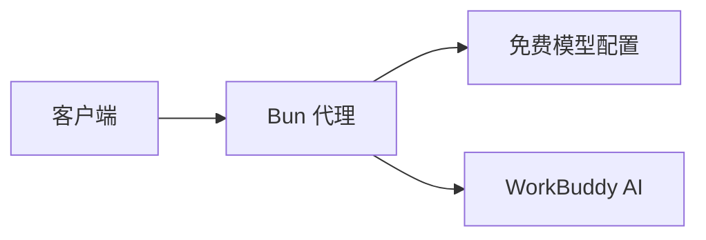

# 使用说明

## 功能

- **免费模型筛选**：查询和调用前检查上游费率与活动有效期。
- **流式透传**：保留文本、推理内容与工具调用字段。
- **非流式聚合**：合并响应及用量，检测不完整的 SSE 输出。
- **凭证隔离**：登录目录只读挂载，代理密钥通过数据卷持久化。



上游为 `https://www.workbuddy.ai`，适配海外版 WorkBuddy AI。模型能力和计费规则由上游决定。

## API 示例

以下示例使用 Bash。先获取模型目录，再将 `MODEL` 设为返回的免费模型 ID：

```bash
export API_KEY="$(docker compose exec -T proxy cat /data/.api-key)"
export BASE_URL=http://127.0.0.1:18081/v1

curl "$BASE_URL/models" -H "Authorization: Bearer $API_KEY"

export MODEL="从上一步选择的模型ID"
curl -N "$BASE_URL/chat/completions" \
  -H "Authorization: Bearer $API_KEY" \
  -H 'Content-Type: application/json' \
  -d "{\"model\":\"$MODEL\",\"messages\":[{\"role\":\"user\",\"content\":\"Reply with exactly: OK\"}],\"stream\":true,\"max_tokens\":512}"
```

省略 `stream` 或设为 `false` 返回 JSON；流式调用以 `[DONE]` 结束。

| 方法 | 路径 | 用途 |
| --- | --- | --- |
| GET | `/health` | 本地健康检查，无需密钥，不验证上游登录 |
| GET | `/v1/models` | 查询当前免费模型 |
| POST | `/v1/chat/completions` | 聊天补全 |

后两个接口需要 `Authorization: Bearer <API_KEY>`。

## Portless 本地 HTTPS

可选：通过 [Portless](https://github.com/vercel-labs/portless) 使用固定本地域名。

```sh
npm install -g portless
portless alias workbuddy 18081
portless proxy start
```

客户端地址改为 `https://workbuddy.localhost/v1`，密钥不变。更改宿主机端口后，需同步更新 alias。

## 配置

### Docker Compose

编辑 `.env`：

| 变量 | 默认值 | 用途 |
| --- | --- | --- |
| `PROXY_PORT` | `18081` | 宿主机端口，仅绑定回环地址 |
| `WORKBUDDY_AUTH_DIR` | macOS 默认认证目录 | 包含登录文件的目录 |

### 直接运行 Bun

安装 Bun 1.3.11 或以上，在项目目录执行：

```sh
bun install --frozen-lockfile
bun start
```

默认地址为 `http://127.0.0.1:18080/v1`，代理密钥保存在 `.api-key`。可通过环境变量调整：

| 变量 | 默认值 |
| --- | --- |
| `LISTEN_HOST` | `127.0.0.1` |
| `PORT` | `18080` |
| `WORKBUDDY_AUTH_FILE` | macOS 默认认证文件路径 |
| `API_KEY_FILE` | 工作目录的 `.api-key` |

Windows / Linux 需显式设置 `WORKBUDDY_AUTH_FILE`。需要自定义可信 CA 时，可配置 `NODE_EXTRA_CA_CERTS`。

## 管理服务

```sh
docker compose ps                  # 查看状态
docker compose logs --tail=50      # 查看日志
git pull
docker compose up -d --build       # 更新并重建
docker compose down               # 停止，保留密钥
```

密钥保存在数据卷中；`down -v` 会删除它。容器配置了 `unless-stopped` 重启策略。多实例部署需使用不同的 Compose 项目名和宿主机端口。

## 故障排查

| 现象 | 处理方式 |
| --- | --- |
| 401 | 重新读取该实例的代理密钥，检查是否混用了登录令牌或其他实例的密钥 |
| 模型缺失 / 400 | 刷新模型目录，检查完整 ID 和免费活动有效期 |
| 502 | 检查 WorkBuddy 登录状态、网络和证书；登录过期后更新认证文件 |
| 域名不可用 | 检查容器状态，执行 `portless get workbuddy` 和 `portless proxy start` |
| 长请求失败 | 检查模型上下文限制；代理请求体上限 16 MiB，上游请求超时 180 秒 |

## 协议与限制

- 支持 Chat Completions；暂不支持 Responses、Anthropic Messages 或管理页面。
- 缺少开头的 `system` 消息时会补充通用提示词；采样与推理参数仅在未传入时使用模型默认值。
- 流式输出中断后，客户端应将未收到 `[DONE]` 视为失败。
- 不自动刷新登录令牌或重试请求。日志不记录对话正文和凭证。

## 开发

```sh
bun install --frozen-lockfile
bun run typecheck
bun test
docker build -t workbuddy-proxy:local .
```

测试无需登录凭证，覆盖免费策略、长请求、工具字段和 SSE 聚合。提交约定见 [CONTRIBUTING.md](../CONTRIBUTING.md)，安全说明见 [SECURITY.md](../SECURITY.md)。

## 参考

- [WorkBuddy2API](https://github.com/Tom6814/WorkBuddy2API)：认证结构和接口路径参考，非运行依赖。
- [WorkBuddy AI](https://www.workbuddy.ai)：上游模型服务。
- [Bun](https://github.com/oven-sh/bun)：运行时与测试工具。
- [Portless](https://github.com/vercel-labs/portless)：可选的本地 HTTPS 代理。

## 许可证

[MIT](../LICENSE)
